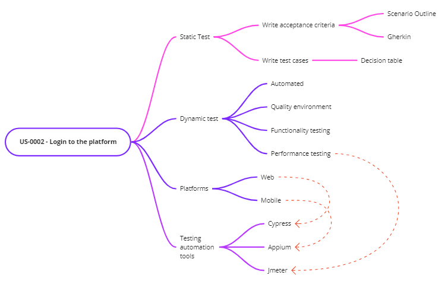
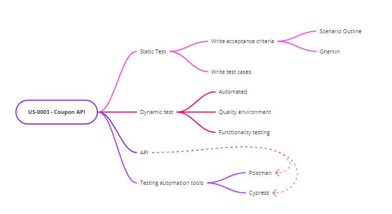

# Something about testing 
:construction: Project in progress :construction:

## Abstract
The main objective of this project is to show my skills in static and dynamic testing processes, based on an activity proposed in the Software Testing course at EBAC.

About the course, [click here](https://ebaconline.com.br/qualidade-de-software)

## Proposition

Considering the user stories: 
- **US-0001** - Add item to cart  
  > **As** an EBAC-SHOP customer  
   **I want** to add products to my cart   
   **To** purchase items  
  > 
  > **Business rules:** 
  > + Do not allow products to be added to the cart above stock availability; 
  > + Block adding out-of-stock products to the cart; 
  > + Must only accept valid discount coupons.
 
- **US-0002** - Login to the platform  
  > **As** an EBAC-SHOP customer  
   **I want** log in to the platform   
   **To** view my orders  
  > 
  > **Business rules:** 
  > + Only active users can log in;
  > + An error message must be displayed if the user enters the wrong login and password;
  > + Login must allow e-mail or username.
   
- **US-0003** - Voucher API  
  > **As** an EBAC-SHOP admin  
   **I want** create a voucher service   
   **To** be able to list and register vouchers  
  > 
  > **Business rules:** 
  > + You must register the vouchers with the mandatory fields below:
  >   * Voucher code
  >   * Value
  >   * Discount type
  >   * Description
  > + Coupon name cannot be repeated 

## Testing strategy mind map
- **US-0001**  
  
- **US-0002**  
  
- **US-0003**  
  

## Test execution
### Static Test
- Acceptance Criteria
  + **US-0001**
  + **US-0002**
  + **US-0003**

- Test Cases
  + **US-0001**
  + **US-0002**
  + **US-0003**

### Dynamic Test
- Web
  + **US-0001**
  + **US-0002**

- Mobile
  + **US-0001**
  + **US-0002**

- API
  + **US-0003**

## Tools  
 
 &nbsp;
 &nbsp;
 &nbsp;
 &nbsp;
 &nbsp;
