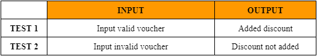
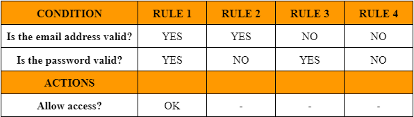
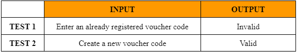

# Something about testing

## Abstract

The main objective of this project is to show my skills in static and dynamic testing processes, based on the activities proposed in the Software Testing course at EBAC.

About the course, [click here](https://ebaconline.com.br/qualidade-de-software)

## Proposition

Considering the user stories:

- **US-0001** - Add item to cart  

  > **As** an EBAC-SHOP customer   **I want** to add products to my cart   **To** purchase items  
  >
  > **Business rules:**
  >
  > - Do not allow products to be added to the cart above stock availability;
  > - Block adding out-of-stock products to the cart;
  > - Must only accept valid discount coupons.

- **US-0002** - Login to the platform  
  > **As** an EBAC-SHOP customer   **I want** log in to the platform   **To** view my orders  
  >
  > **Business rules:**
  >
  > - Only active users can log in;
  > - An error message must be displayed if the user enters the wrong login and password;
  > - Login must allow e-mail or username.
- **US-0003** - Voucher API  
  > **As** an EBAC-SHOP admin   **I want** create a voucher service   **To** be able to list and register vouchers  
  >
  > **Business rules:**
  >
  > - You must register the vouchers with the mandatory fields below:
  >   - Voucher code
  >   - Value
  >   - Discount type
  >   - Description
  > - Coupon name cannot be repeated

## Testing strategy mind map

- **US-0001**  
  
- **US-0002**  
  
- **US-0003**  
  

## Test execution

### Static Test

- Acceptance Criteria  
  I chose to use the **_Gherkin_** language to write the acceptance criteria, documentation available at the links below:

  - [**US-0001**](1_Scenarios/US-0001.feature)
  - [**US-0002**](1_Scenarios/US-0002.feature)
  - [**US-0003**](1_Scenarios/US-0003.feature)

- Test Cases

  - **US-0001**  
    Looking at the requirements:  
    a. Do not allow products to be added to the cart above stock availability; 
    b. Block adding out-of-stock products to the cart; 
    I came up with the following visualization of partitioning and limit values:  
    
     
    From there, I wrote the test case for this scenario:  

    **CT01 - Add products to cart**  
    **Description:** Test to validate rules for adding items to the product page  
    **Preconditions:** Single product with stock or no stock available  
    **Required parameters:** Select size and color  
    **Actions:**  
    1- Go to the product page  
    2- Select size and color  
    3- Enter quantity  
    4- Click on the Buy button  
    **Expected results:**  
    

    Finally, for the last business rule:  
    c. Must only accept valid discount coupons.  
    As this is a boolean rule, I created the test case for coverage in the valid and invalid cases:  

    **CT02 - Using a discount voucher**  
    **Description:** Test of the use of a voucher when purchasing a product  
    **Preconditions:** Valid voucher  
    **Required parameters:** Have product added to cart  
    **Actions:**  
    1- Access the shopping cart  
    2- Enter the voucher code  
    3- Confirm the discount in the final price  
    **Expected results:**  
    

  - **US-0002**  
    For this user story, we have the following rules:  
    a. Only active users can log in;  
    b. An error message must be displayed if the user enters the wrong login and password;  
    c. Login must allow e-mail or username.  
    Just to illustrate the login dynamics, I've used the simplified decision tables for each scenario:

    - Access with e-mail  
      
    - Access with username  
      

    From this, defining the test case:  

    **CT01 - Login testing**  
    **Description:** Test access with email, or username and password  
    **Preconditions:** User already registered  
    **Required parameters:** Massive data with email, password and username  
    **Actions:**  
    1- Access login page  
    2- Enter email or username and password  
    3- Click on the Login button  
    **Expected results:**  
    

  - **US-0003**  
    For this last user story, apart from the indication of fields to fill in, we only have a very simple rule:  
    a. Coupon name cannot be repeated.  

    Visualizing the rule, we have:  
    

    So I wrote the test case like this:  

    **CT01 - Create voucher code**  
    **Description:** Test creation of voucher for discount on purchases.  
    **Preconditions:** Have administrator password, single name voucher  
    **Required parameters:** Voucher code, Amount, Discount type, description  
    **Actions:**  
    1- Access the API  
    2- List existing vouchers  
    3- Enter new voucher details  
    4- Register new voucher  
    **Expected results:**  
    

### Dynamic Test

- Web  
  The tests were carried out using the Cypress platform. 
  I chose to use customized commands and also data masses in the fixture folder. 
  Check out the structure in the options:

  - [**US-0001**](2_Web_Testing/cypress/e2e/US001)
  - [**US-0002**](2_Web_Testing/cypress/e2e/US002)

- Mobile  
  For the mobile test, I used Appium, with the Webdriver\IO structure. 
  I implemented it for local testing, but I also included a framework for use in Sauce Labs. 
  I opted for a simple login test, with just one spec including all the scenarios, but also using the page objects feature. 
  Check out the structure at the link below:

  - [**US-0002**](3_Mobile_Testing/test/specs/US002)

- API  
  API tests were carried out using Postman and Cypress, the configuration and code files are in the link below.
  - [**US-0003**](2_Web_Testing/cypress/e2e/US003)

## Performance Testing

This test was carried out using Jmeter, testing performance with the login flow.

Performance test configurations:

- Virtual users: 20
- Execution time: 2 minutes
- RampUp: 20 seconds
- Data mass: User / password

Check out the configuration [here](4_Performance_Testing).

## Tools

 
 &nbsp;
 &nbsp;
 &nbsp;
 &nbsp;
 &nbsp;
 &nbsp;
